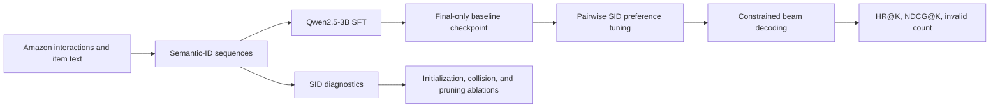

<div align="center">

# MiniOneRec-5090D

### Single-GPU Research Extension for Generative Recommendation

[](#research-roadmap)
[](#experimental-setup)
[](#experimental-setup)
[](#reproduction)
[](./LICENSE)

An independent reproduction and method study built on
[MiniOneRec](https://github.com/AkaliKong/MiniOneRec), using Qwen2.5-3B on one
RTX 5090D.

[Our Code](#our-research-contributions) | [Results](#current-results) | [Method](#research-pipeline) | [Reproduction](#reproduction) | [Roadmap](#research-roadmap)

</div>

## Current Research Result

| Matched comparison | HR@20 | NDCG@20 | Invalid predictions | Additional tuning time |
|---|---:|---:|---:|---:|
| R0: final-only SID SFT | 0.01500110 | 0.00476696 | 0 | baseline |
| **D1: our pairwise SID preference stage** | **0.01544231** | **0.00517191** | **0** | **119.7 s** |
| **Relative change** | **+2.9%** | **+8.5%** | unchanged | single RTX 5090D |

> [!IMPORTANT]
> This repository documents an ongoing sampled benchmark, not a complete
> reproduction of every result in the MiniOneRec paper. The current improvement
> is based on one main random seed and must be validated across seeds, larger
> training samples, and additional datasets before it can support a general
> performance claim.

## Overview

Large-language-model-based generative recommendation is usually evaluated with
multi-GPU training and expensive reinforcement learning. This project asks a
more practical research question:

> How far can semantic-ID generative recommendation be reproduced and improved
> on one consumer GPU by changing the trainable surface, the semantic-ID design,
> and the post-SFT objective?

The current system runs `Qwen/Qwen2.5-3B` on a single NVIDIA RTX 5090D under
WSL. It establishes a reproducible supervised fine-tuning (SFT) and constrained
decoding pipeline, audits semantic-ID (SID) quality, and evaluates lightweight
alternatives to the original resource-intensive recommendation-oriented RL
stage.

The strongest local direction so far is a reference-free pairwise SID
preference stage. On the current sampled `Industrial_and_Scientific` benchmark,
it improves HR@20 by `2.9%` and NDCG@20 by `8.5%` over the matched final-only SFT
baseline while retaining zero invalid predictions.

## Our Research Contributions

The original MiniOneRec implementation remains in this repository as the
upstream foundation required to run the experiments. The following components
are the local research implementation developed for this project:

| Contribution | Our code | Purpose |
|---|---|---|
| Pairwise SID preference tuning | [`repro/pairwise_preference_train.py`](./repro/pairwise_preference_train.py) | Trains gold SIDs against prefix-matched hard negatives without a reference model |
| D1 end-to-end pipeline | [`repro/run_d1_pairwise_pipeline_5090d.sh`](./repro/run_d1_pairwise_pipeline_5090d.sh) | Runs preference tuning, constrained evaluation, and result archiving |
| SID quality audit | [`repro/sid_diagnostics.py`](./repro/sid_diagnostics.py) | Measures collisions, prefix skew, code usage, and Gini statistics |
| Collision-aware SID variant | [`repro/make_collision_sid_variant.py`](./repro/make_collision_sid_variant.py) | Adds disambiguation codes and rewrites train/valid/test SID sequences consistently |
| History-pruning variant | [`repro/make_history_recent_variant.py`](./repro/make_history_recent_variant.py) | Produces controlled recent-history datasets and change statistics |
| Reproducible experiment archive | [`repro/archive_run.py`](./repro/archive_run.py) | Recomputes metrics and stores compact JSON/Markdown experiment manifests |
| 5090D experiment runners | [`repro/`](./repro/) | Provides environment checks and matched A0/A1/A2/B1/C1/D1 pipelines |
| SFT research extensions | [`sft.py`](./sft.py) | Adds semantic SID initialization, LoRA, output-head SID row training, and final-only saving |

See [`RESEARCH_CONTRIBUTIONS.md`](./RESEARCH_CONTRIBUTIONS.md) for the complete
upstream-versus-local code map and [`repro/README.md`](./repro/README.md) for the
research code entry points.

### What Changed in `sft.py`

Compared with the upstream implementation, the local training path adds:

- item-text-mean semantic initialization for newly introduced SID tokens;
- gradient masking for both input embeddings and an untied output `lm_head`;
- configurable LoRA on `q_proj`, `v_proj`, and `o_proj`;
- final-only checkpoint saving for low-I/O single-GPU experiments;
- merged standalone checkpoints for LoRA evaluation;
- explicit initialization of `original_vocab_size` before vocabulary resizing.

## Research Questions

1. Can a 3B-parameter language model support useful generative recommendation
   adaptation on one consumer GPU without full-parameter training?
2. Which intervention matters most under limited compute: SID initialization,
   parameter-efficient adaptation, SID construction, history pruning, or
   preference optimization?
3. Can pairwise preference learning recover part of the benefit of heavier
   GRPO-style training without maintaining a reference model or generating
   multiple online candidates?
4. Are observed gains stable across random seeds, data scales, item domains, and
   negative-sampling strategies?

## Research Pipeline



### Baseline

The fair baseline, R0, freezes the language model and trains the newly added SID
token rows. It stores only the final checkpoint, which removes the large I/O
overhead observed in the first smoke run.

### Lightweight Preference Tuning

For each recommendation prompt, D1 pairs the gold SID with a hard negative SID,
preferentially sampled from the same SID prefix. The model remains frozen except
for gradient-masked SID token rows. Its objective combines a reference-free
logistic preference loss with a chosen-SID SFT regularizer:

$$
\mathcal{L} = -\log \sigma\left(\beta\left[s(y^+) - s(y^-)\right]\right)
+ \lambda\mathcal{L}_{\mathrm{SFT}},
$$

where $s(\cdot)$ is the sequence log-probability assigned by the current model,
$y^+$ is the target SID, and $y^-$ is the hard negative SID. The default local
configuration uses `beta=0.1` and `lambda=0.1`.

### Valid Decoding

Evaluation uses constrained beam decoding over the closed SID vocabulary. Every
reported run produced zero invalid predictions, so HR and NDCG are not inflated
or obscured by malformed item identifiers.

## Experimental Setup

| Component | Configuration |
|---|---|
| Hardware | Single NVIDIA RTX 5090D |
| Operating environment | WSL, conda environment `minionerec-5090d` |
| Backbone | `Qwen/Qwen2.5-3B` |
| Dataset | Amazon `Industrial_and_Scientific` |
| Baseline SFT sample | 1,024 sampled rows per task, 3,072 mixed training records |
| SFT validation | 1,024 records |
| Test set | 4,533 records |
| D1 preference sample | 1,024 training pairs, 256 validation pairs |
| Decoding | Constrained beam search, 20 beams |
| Primary metrics | HR@1/3/5/10/20, NDCG@1/3/5/10/20, invalid predictions |

## Current Results

### Main Comparison

| Method | Trainable surface | Stage runtime | HR@20 | NDCG@20 | Invalid |
|---|---|---:|---:|---:|---:|
| R0: final-only SFT | SID token rows | 772.6 s | 0.01500110 | 0.00476696 | 0 |
| **D1: pairwise SID preference** | SID token rows | **+119.7 s** | **0.01544231** | **0.00517191** | **0** |

| Metric | R0 | D1 | Relative change |
|---|---:|---:|---:|
| HR@20 | 0.01500110 | 0.01544231 | **+2.9%** |
| NDCG@20 | 0.00476696 | 0.00517191 | **+8.5%** |

The `+119.7 s` value is the additional D1 stage applied to the R0 checkpoint,
not the total end-to-end training time.

### Ablation Study

| ID | Variant | Runtime | HR@20 | NDCG@20 | Main observation |
|---|---|---:|---:|---:|---|
| A0 | Initial freeze-SID smoke run | 3129.5 s | 0.01544231 | 0.00536662 | Correct but dominated by intermediate checkpoint I/O |
| R0 | Final-only freeze-SID baseline | 772.6 s | 0.01500110 | 0.00476696 | Fair comparison baseline |
| A1 | Semantic initialization + frozen LLM | 3283.7 s | 0.00132363 | 0.00051600 | Semantic initialization alone was unstable |
| A2 | Semantic initialization + LoRA | 1662.8 s | 0.00750055 | 0.00229111 | LoRA recovered part of the loss but remained below R0 |
| C1 | Collision-aware SID suffix | 3323.1 s | 0.01478050 | 0.00421362 | Eliminating full SID collisions was insufficient |
| B1 | Keep the five most recent history items | 735.1 s | 0.01411869 | 0.00455581 | Only 4.9% faster than R0 and less accurate |
| D1 | Pairwise SID preference, LR `2e-5` | +119.7 s | **0.01544231** | **0.00517191** | Best current local result at K=20 |
| D1-LR | Pairwise SID preference, LR `1e-5` | +123.5 s | 0.01500110 | 0.00464173 | Lower LR removed the improvement |

### SID Diagnostics

| Diagnostic | Value |
|---|---:|
| Items | 3,686 |
| Unique full SID sequences | 3,670 |
| Full SID collision groups | 15 |
| Items affected by collisions | 31 |
| SID token-usage Gini | 0.38698 |
| Target interaction-frequency Gini | 0.46471 |
| Largest observed two-token prefix | `<a_223><b_198>`, 47 items |

The C1 variant removed all 15 full-SID collision groups, but it did not improve
R0. This result suggests that collision count alone is not an adequate proxy for
recommendation quality; SID geometry, prefix allocation, and training alignment
remain plausible factors.

## What Has Been Learned

- **Checkpoint policy is an experimental variable.** Final-only saving reduced
  the baseline runtime from approximately 3,129.5 s to 772.6 s. Runtime claims
  must therefore compare runs with matched persistence settings.
- **Naive semantic initialization is fragile.** Mean text-embedding
  initialization did not improve retrieval under frozen-LLM training. LoRA
  helped, but did not close the gap to the baseline.
- **Collision removal is not enough.** Perfectly disambiguating the observed SID
  collisions did not improve recommendation metrics.
- **Uniform history truncation is a weak speed-quality trade-off.** Keeping the
  five most recent items gave only a small speed gain after controlling for
  checkpoint I/O.
- **Preference tuning is promising but not yet conclusive.** D1 improved both
  K=20 metrics, but HR@10 decreased from `0.00661813` to `0.00529451` and its
  pairwise validation accuracy was `0.4961`. Seed stability and better negative
  construction are the immediate priorities.

## Reproduction

### 1. Enter WSL and activate the environment

```bash
cd /mnt/d/Document/OneminiRec/MiniOneRec
source ~/miniforge3/etc/profile.d/conda.sh
conda activate minionerec-5090d
```

### 2. Verify the RTX 5090D environment

```bash
python repro/check_5090d_env.py --model Qwen/Qwen2.5-3B
```

### 3. Run the matched final-only baseline

```bash
bash repro/run_a0_finalonly_pipeline_5090d.sh
```

### 4. Run lightweight pairwise preference tuning

```bash
bash repro/run_d1_pairwise_pipeline_5090d.sh
```

### 5. Run the next seed-stability experiment

```bash
RUN_ID=d1_pairwise_sidpref_seed43_qwen25_3b_industrial \
SEED=43 \
OUTPUT_DIR=output_dir/qwen25_3b_Industrial_and_Scientific_d1_pairwise_seed43_single5090d \
RESULT_DIR=results/d1_pairwise_seed43_single5090d \
bash repro/run_d1_pairwise_pipeline_5090d.sh
```

See the detailed [benchmark record](./repro/BENCHMARK_5090D.md),
[environment and pipeline guide](./repro/MINIONEREC_5090D_QWEN3B_PIPELINE.md),
and [resume checkpoint](./repro/RESUME_5090D.md) before starting a new run.

## Repository Map

```text
MiniOneRec/
|-- README.md                         # Local research results and code entry points
|-- README_UPSTREAM.md                # Preserved upstream documentation
|-- RESEARCH_CONTRIBUTIONS.md         # Upstream-versus-local ownership map
|-- GITHUB_PUBLISHING_GUIDE.md        # Safe publishing instructions
|-- repro/
|   |-- README.md                     # Local research code index
|   |-- BENCHMARK_5090D.md            # Experimental protocol and results
|   |-- RESUME_5090D.md               # Current state and next command
|   |-- pairwise_preference_train.py  # D1 preference objective
|   |-- sid_diagnostics.py            # SID collision and distribution audit
|   |-- run_*_5090d.sh                # Reproducible experiment entry points
|   `-- archive/                       # Compact result manifests
|-- sft.py                             # Modified SFT implementation
|-- evaluate.py                        # Constrained recommendation evaluation
`-- output_dir/                        # Local checkpoints, excluded from Git
```

## Research Roadmap

- [x] Reproduce Qwen2.5-3B SFT and constrained decoding on one RTX 5090D.
- [x] Establish a fair final-only runtime baseline.
- [x] Audit SID collisions, token usage, and prefix skew.
- [x] Evaluate semantic initialization, LoRA, collision repair, and history
  pruning.
- [x] Implement a reference-free pairwise SID preference stage.
- [ ] Repeat D1 under additional random seeds and report mean and standard
  deviation.
- [ ] Compare prefix-hard negatives with category-, popularity-, and
  retrieval-based negatives.
- [ ] Scale the strongest configuration beyond the current sampled setting.
- [ ] Transfer the benchmark to a second Amazon category.
- [ ] Study variable-length and frequency-aware SID allocation.
- [ ] Compare lightweight preference tuning with a memory-feasible GRPO control.

## Limitations

1. Current model comparisons use a sampled training configuration rather than
   the full MiniOneRec training scale.
2. The strongest D1 result has not yet been replicated across random seeds.
3. Experiments currently cover one Amazon category and one 3B backbone.
4. HR@20 and NDCG@20 improved, but HR@10 and pairwise validation behavior remain
   mixed.
5. The project evaluates local improvements over its matched R0 baseline; it
   does not claim superiority over the published full-scale MiniOneRec system.

## CV-Ready Description

**Efficient Generative Recommendation with Qwen2.5-3B on RTX 5090D**<br>
Independent Research Project

- Reproduced and extended a MiniOneRec-style semantic-ID generative
  recommendation pipeline on a single RTX 5090D using Qwen2.5-3B and constrained
  beam decoding.
- Built reproducible SFT, evaluation, experiment-archiving, and SID-diagnostic
  workflows; conducted controlled ablations on semantic initialization, LoRA,
  collision-aware SID construction, and history pruning.
- Designed a reference-free pairwise SID preference objective with prefix-aware
  hard negatives, improving HR@20 by `2.9%` and NDCG@20 by `8.5%` over the
  matched final-only baseline in the current sampled benchmark, with zero
  invalid predictions.
- Ongoing work evaluates seed stability, stronger hard-negative mining, and
  transfer across data scales and item domains.

## Attribution and License

This repository is a research extension of the open-source
[MiniOneRec](https://github.com/AkaliKong/MiniOneRec) framework. The original
project and this derivative codebase are distributed under the
[Apache License 2.0](./LICENSE). Model and dataset use remain subject to their
respective licenses and terms.

For academic use, cite the original MiniOneRec report as requested in the
upstream [README](./README_UPSTREAM.md). Compact local experiment manifests are preserved
under [`repro/archive/`](./repro/archive/) for auditability.
